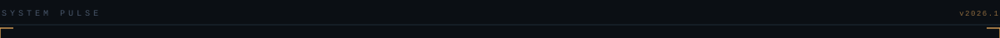
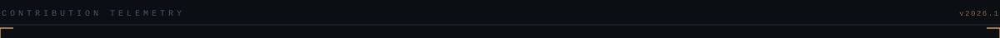

 

<h3>LANGUAGES &amp; TOOLS</h3>

<table>
<tr>
<td align="left" width="33%">

<strong>PROGRAMMING LANGUAGES</strong>

  

</td>

<td align="left" width="33%">

<strong>AI / MACHINE LEARNING</strong>

  

  

<code>scikit-learn</code>

</td>

<td align="left" width="33%">

<strong>INFERENCE / COMPUTE</strong>

  

<code>CUDA · ONNX · TensorRT</code>

</td>
</tr>

<tr>
<td align="left">

<strong>DEVOPS &amp; INFRASTRUCTURE</strong>

  

</td>

<td align="left">

<strong>SYSTEMS &amp; EDGE</strong>

  

</td>

<td align="left">

<strong>DATA</strong>

  

  

<code>NumPy · Pandas</code>

</td>
</tr>
</table>

 

<h3 align="center">GITHUB ACTIVITY</h3>

 

 

 

<h3>CAPABILITIES</h3>

<code>Edge Inference · Neuro-Symbolic AI · Computer Vision · Anomaly Detection · CUDA Optimization · Autonomous Pipelines · LLM Guardrails</code>

  

<strong>INFERENCE RUNTIME</strong>

  

  

<strong>SYSTEMS LAYER</strong>

  

  

<strong>INFRASTRUCTURE &amp; EDGE</strong>

  

  

<strong>DATA LAYER</strong>

  

 

<h3>ACTIVE SYSTEMS</h3>

  

<strong>NEURO-SYMBOLIC AI</strong>

  

Neuro-symbolic reasoning and AI systems

  

   

  

<strong>AGENT SYSTEMS</strong>

  

Autonomous agent systems and local AI

  

  

<code>Neuro-Symbolic AI · Agent Systems · Local AI</code>

<h3>OPEN CHANNEL</h3>

 

 

<code>AaditPani-RVU/AaditPani-RVU · v2026.1</code>

  

