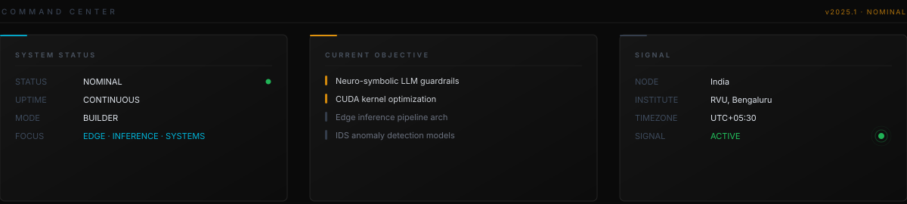

 

    
  

  ---

  

    
  

  ---

  ### SYSTEM PULSE

  

  <table>
    <tr>
      <td>
        
      </td>
      <td>
        
      </td>
    </tr>
  </table>
  

  

    
  

  ---

  ### CONTRIBUTION TELEMETRY

  

    
     
    <code>NEURAL_ACTIVITY_LOG :: commit history visualized as autonomous signal propagation</code>
  

  ---

  ### RUNTIME STACK

  

  <strong>INFERENCE RUNTIME</strong>

  
  
  
  
  

  <strong>SYSTEMS LAYER</strong>

  
  
  
  
  

  <strong>INFRASTRUCTURE</strong>

  
  
  
  
  

  <strong>DATA LAYER</strong>

  
  
  
  

  

  ---

  ### ACTIVE DEPLOYMENTS

  

  <table>
    <tr>
      <td align="center">
        
      </td>
      <td align="center">
        
      </td>
    </tr>
  </table>
  <code>[ neurosym-ai ]</code> · neuro-symbolic rule engine · output guards · streaming · agent system
  

  ---

  ### AI SYSTEMS SURFACE

  | DOMAIN | CAPABILITY | STATUS |
  |:---|:---|:---:|
  | Edge Inference | TensorRT · ONNX · quantization |  |
  | Anomaly Detection | IDS · unsupervised · LSTM |  |
  | Neuro-Symbolic AI | rule engines · guardrails · SMT |  |
  | Computer Vision | object detection · segmentation |  |
  | CUDA Optimization | kernel fusion · memory bandwidth |  |
  | Autonomous Pipelines | DAG orchestration · agents |  |
  | LLM Guardrails | output guards · streaming rules |  |
  | Impact Forecasting | symbolic + LLM hybrid analysis |  |

  ---

  ### WAKATIME TELEMETRY

  

    
     
    <code>TELEMETRY_SOURCE :: WakaTime · rolling 7-day window · auto-synced</code>
  

  ---

  ### LIVE FEED

  

   &nbsp;Building v0.4.0 of neurosym-ai — repair loop telemetry + policy diff engine

   &nbsp;CUDA warp-level primitives for batched inference kernels

   &nbsp;Edge IDS false-positive rate on embedded deployment

   &nbsp;TensorRT-LLM integration for quantized edge model serving

  

  ---

  ### INFRASTRUCTURE SURFACE

  

  <table>
    <tr>
      <td align="left" valign="top" width="33%">
        <strong>CONTAINER OPS</strong>  
        Docker · Compose · BuildKit 
        Multi-stage builds 
        Image optimization
      </td>
      <td align="left" valign="top" width="33%">
        <strong>PIPELINE INFRA</strong>  
        GitHub Actions · CI/CD 
        Artifact registries 
        Automated test gates
      </td>
      <td align="left" valign="top" width="33%">
        <strong>EDGE SYSTEMS</strong>  
        Raspberry Pi · Jetson 
        ARM64 inference 
        TFLite · ONNX Runtime
      </td>
    </tr>
  </table>
  

  ---

  ### PORTFOLIO_ENDPOINT

  

  

    

  <table>
    <tr>
      <td align="center">
        <code>$ curl -sI https://portfolio.aadi-pani.workers.dev | grep -E 'HTTP|cf-ray|server'</code> 
        <code>HTTP/2 200 &nbsp;·&nbsp; server: cloudflare &nbsp;·&nbsp; runtime: workers &nbsp;·&nbsp; STATUS: LIVE</code>
      </td>
    </tr>
  </table>

   
  <code>EDGE_ENDPOINT :: portfolio.aadi-pani.workers.dev · Cloudflare Workers · Global CDN · Zero Cold Start</code>

  

  ---

  ### OPEN CHANNEL

  

  
  
  
  
  

  

  ---

  

    
     
    <code>SYSTEM :: AaditPani-RVU/AaditPani-RVU · BUILD 2025 · AUTONOMOUS</code>
      
    
  

