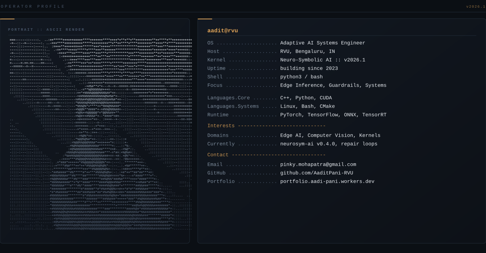
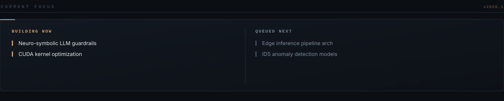

  

  

  

  

### SYSTEM PULSE

### SYSTEM PULSE

<table>
  <tr>
    <td>
      
    </td>
    <td>
      
    </td>
  </tr>
</table>

  

 

  

  

### CAPABILITIES

<code>Edge Inference · Neuro-Symbolic AI · Computer Vision · Anomaly Detection · CUDA Optimization · Autonomous Pipelines · LLM Guardrails</code>

 

<strong>INFERENCE RUNTIME</strong>

<strong>SYSTEMS LAYER</strong>

<strong>INFRASTRUCTURE &amp; EDGE</strong>

<strong>DATA LAYER</strong>

### ACTIVE SYSTEMS

  
  

  <code>Neuro-Symbolic AI · Agent Systems · Local AI</code>

  

### OPEN CHANNEL

 

  
   
  <code>AaditPani-RVU/AaditPani-RVU · v2026.1</code>
    
  

